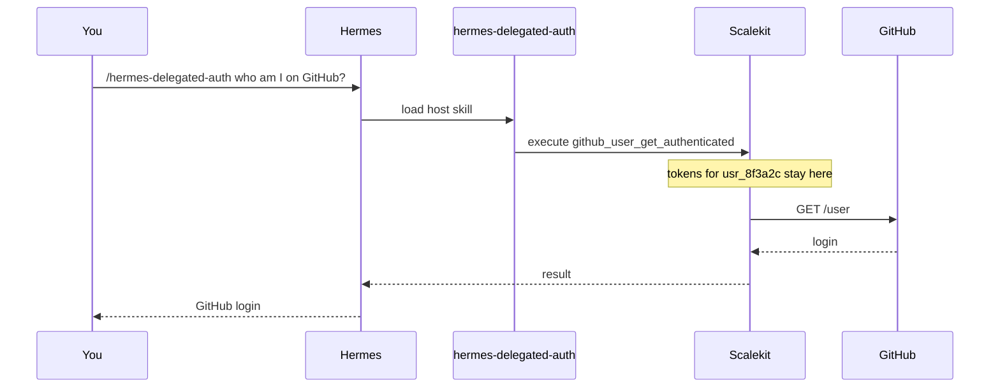

# Hermes + AgentKit example

Companion to the how-to: [Use AgentKit with Hermes](https://docs.scalekit.com/agentkit/hermes/).

Hermes talks. Scalekit holds the tokens. GitHub answers as `usr_8f3a2c`. This repo is not a Hermes clone.

Scalekit provides auth and actions on behalf of users, with 500+ connectors and 20,000+ tools.

```text
you
  hermes chat
    /hermes-delegated-auth
      tool_exec.py
        Scalekit vault
          github-connect
            github_user_get_authenticated
```



```text
this repo/                 # install + env + one proven read
~/.hermes/skills/
  hermes-delegated-auth/   # host skill (not this repo)
Scalekit                   # token vault
github-connect             # dashboard connection name
```

## Install the host skill

```bash
hermes skills install scalekit-inc/authstack/kits/agentkit/host/hermes-delegated-auth
```

Then check:

```bash
hermes skills list
```

The table should list `hermes-delegated-auth` as enabled. In chat, use `/hermes-delegated-auth`.

## Configure env

Copy `.env.example` to `~/.hermes/.env` (or merge the four names into the file you already have).

| Name | What it is |
|---|---|
| `SCALEKIT_ENVIRONMENT_URL` | Dashboard → Developers → Settings → API Credentials |
| `SCALEKIT_CLIENT_ID` | Same page |
| `SCALEKIT_CLIENT_SECRET` | Same page. Do not commit it. |
| `SCALEKIT_IDENTIFIER` | Opaque user id you choose. Sample: `usr_8f3a2c` |

`SCALEKIT_IDENTIFIER` is a lookup label. It is not a dashboard credential. Do not use an email.

Create a **GitHub** connection in **Dashboard → AgentKit → Connections**. Copy the exact Connection name. This example uses `github-connect`.

## Authorize, then read

From the installed skill scripts:

```bash
cd "${HERMES_HOME:-$HOME/.hermes}/skills/hermes-delegated-auth/scripts"

uv run tool_exec.py --list-connections --provider GITHUB
uv run tool_exec.py --generate-link --connection-name github-connect
```

If status is not `ACTIVE`, open the magic link, then run `--generate-link` again.

Proven read:

```bash
uv run tool_exec.py --execute-tool \
  --tool-name github_user_get_authenticated \
  --connection-name github-connect \
  --tool-input '{}'
```

Or from this repo:

```bash
./scripts/github-whoami.sh
```

That call returns the GitHub login for `SCALEKIT_IDENTIFIER`. We ran it live against `github-connect`.

In Hermes chat:

```text
/hermes-delegated-auth who am I on GitHub?
```

## Optional: Virtual MCP on this Hermes host

Draft. Not live-verified yet.

Use this when you want a scoped tool list on a gateway you operate.
One host. One bearer. You remint.

1. Create the Virtual MCP config once. Save `mcp_server_url`.
2. Run `scripts/mint-session-token.py`.
3. Put the token in `SCALEKIT_MCP_SESSION_TOKEN`.
4. Point Hermes at `examples/hermes-vmcp.config.yaml`.
5. Restart, or `/reload-mcp`.
6. Before expiry: mint again, write the env var, `/reload-mcp`.

The mint script reads `SCALEKIT_*` from the environment or `~/.hermes/.env`. It also needs `SCALEKIT_MCP_CONFIG_ID`. Put the saved URL in `SCALEKIT_MCP_SERVER_URL`.

```bash
uv run --with scalekit-sdk-python scripts/mint-session-token.py
```

Do not run `hermes mcp login`. Do not set `auth: oauth`.

## What this example does not cover

- Gmail. This environment has no Gmail connection. Do not treat unread mail as proven here.
- App-code SDKs. That is [integrate AgentKit in app code](https://docs.scalekit.com/agentkit/quickstart/), not this host skill.

## License

MIT
